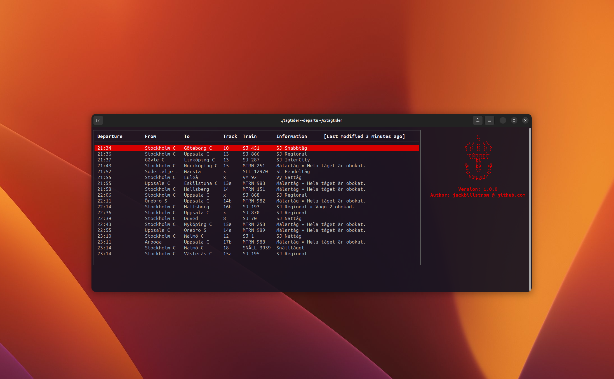

# Tågtider
A simple CLI tool for fetching train departures from Trafikverket's API.



## Requirements
- [Go](https://golang.org/dl/)
- A terminal emulator that supports [ANSI escape codes](https://en.wikipedia.org/wiki/ANSI_escape_code#Colors). Any modern terminal emulator should work.

## Installation
The easiest way to install is to grab the latest release from [releases]() and run the following command:

**Linux**
```bash
TODO
```

**Windows**
```ps1
TODO
```

## Usage
```bash
tagtider --departure <station>
```

Example:
```bash
tagtider --departure "Stockholm C"
```

## License
[Gnu GPL v3](https://www.gnu.org/licenses/gpl-3.0.en.html)

## Disclaimer
This project is not affiliated with Trafikverket in any way. It is simply a hobby project, and should be treated as such.

## TODO
- [ ] Add tabs for departure and arrival
- [ ] Highlight cancelled trains
- [ ] Enable autocomplete for stations?
- [ ] Write more tests

## Contributing
Pull requests are welcome. For major changes, please open an issue first to discuss what you would like to change.

## Acknowledgements
- [Trafikverket](https://www.trafikverket.se/)
- [Bubbletea](https://github.com/charmbracelet/bubbletea)
- [Lipgloss](https://github.com/charmbracelet/lipgloss)
